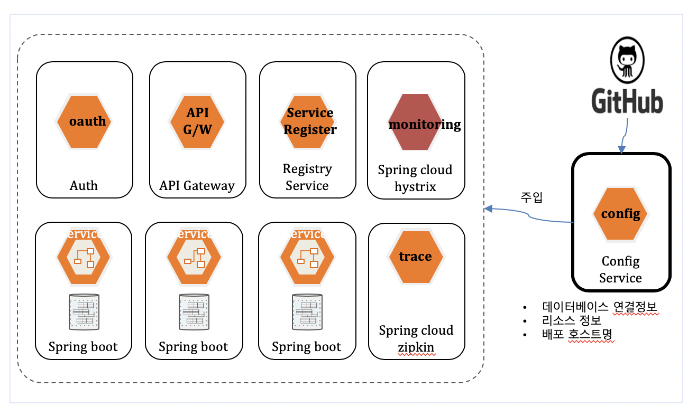
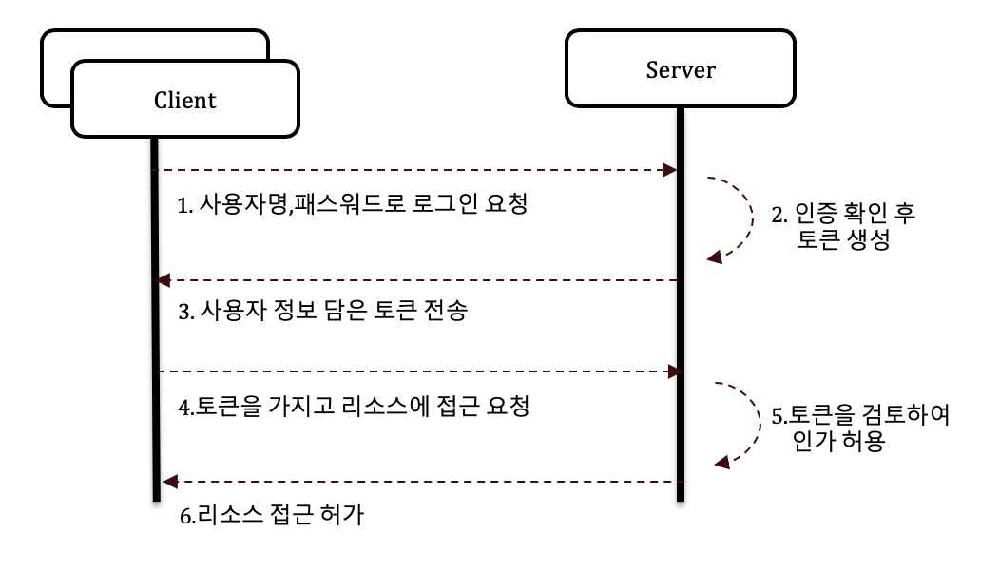
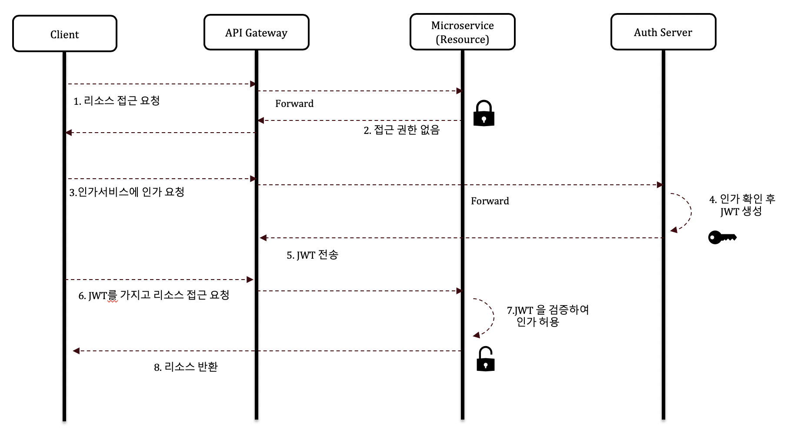

2장 MSA에 대한 이해
---
**소프트웨어 아키텍처**란 소프트웨어를 구성하는 요소와 그 구성요소 간의 관계를 정의한 것  
아키텍처를 정의하는 과정은 시스템 구축을 위한 다양한 영억에 대한 해결책을 찾는 과정이라고 할 수 있다.  

현대의 애플리케이션은 리액티브(reactive)한 속성을 가져야한다.  

#### 요나스 보네르의 리액티브 선언문  

1. 응답성(Responsive) : 사용자에게 신뢰성 있는 응답을 빠르고 적절하게 제공하는 것
2. 탄력성(Resilient) : 장애가 발생하거나 부분적으로 고장나더라도 시스템 전체가 고장나지않고 빠르게 회복하는 능력
3. 유연성(Elastic) : 시스템의 사용량에 변화가 있더라도 균일한 응답성을 제공하는 것
4. 메세지기반(Message Driven) : 비동기 메세지 전달을 통해 위치 투명성, 느슨한 결합, 논블로킹 통신을 지향하는 것

리액티브(reactive)란 다양한 상황에 따라 빠르고 적절하게 반응하는 시스템을 의미한다.  

---
현대의 오픈 소스는 유명한 벤더 제품군 만큼이나 품질이 높아지고 다양한 기능을 지원하면서 서로 다른 오픈소스  
제품 간에도 충분한 호환성을 제공하기 때문에 최근의 아키텍처 설계는 필요한 영역에 적절한 솔루션을 선택하고  
조합하는 개방적인 방식으로 바뀌고 있다.

1. **인프라** - VM, 베어메탈, AWS,Google Cloud, Azure
2. **플랫폼** - 데브옵스 파이프라인(Jenkins,SonarQube), 협업 환경(Jira, Confluence), 메세지 버스(Rabbit MQ, Kafka), 로깅중앙화  
   (ELK),라이브러리 저장소(Sonatype,Nexus), API Gateway(Netflix Zuul), 모니터링(Histrix),서비스 탐색(Eureka)
3. **애플리케이션** - 채널(모바일,브라우저), 핵심 서비스(프론트엔드, 백엔드),데이터(RDB,Redis 등)

기반이 되는 하드웨어 인프라가 있고, 인프라 위에 애플리케이션 구동을 위한 플랫폼이 올라가고, 플랫폼 위에 서비스가 구동된다.  
인프라 영역과 플랫폼 영역, 애플리케이션 영역에 있는 구성요소 및 그 관계들을 정의하는 것을 MSA 외부 아키텍처(Outer Architecture)라고 한다.  
실제 비즈니스가 실행되는 비즈니스 애플리케이션,즉 각 마이크로 서비스의 내부 구조를 정의해야 하는데 이를 MSA 내부 아키텍처(Inner architecture)
라고 한다.  

### 가상 머신(VM)과 컨테이너의 차이
가상 머신은 하이퍼바이저라는 소프트웨어 기술을 사용하여 하나의 시스템에서 여러개의 운영체제를 사용하는 기술이다.  
반면에, 컨테이너는 가상의 격리된 공간을 생성한다. 가장 큰 차이점은 게스트 OS의 유무이다.

### Docker
대표적인 컨테이너 기술로 도커 컨테이너는 레이어 단위의 이미지를 포개는 방식으로 구성된다.  
애플리케이션 구동을 위한 기반 이미지(Base RHEL), 운영체제, 런타임, 애플리케이션이 이미지로 정의 된다.

### Docker의 장점
1. 이식성 : 어떠한 호스트 커널이나 플랫폼 버전에 상관없이 도커만 실행할 수 있으면 사용 가능하며 동일하게 동작된다.
2. 신속성 : 크기가 작고 가볍기 때문에 빠르게 배포 가능하며, 문제 발생 시 수정할 필요없이 새로 기동하면 된다.
3. 재사용성 : 동일한 환경을 재사용해서 쉽게 설정 가능하기 때문에 개발, 테스트, 스테이징, 프로덕트 환경을 동일한 환경으로 구축하기 쉽다.

### 컨테이너 오케스트레이션
컨테이너가 많아지면 그에 따른 자동 배치, 장애 복구, 확장 및 축소, 컨테이너 간 통신, 로드 밸런싱 등 컨테이너 관리 기능이 필요해진다.  
이러한 기술을 컨테이너 오케스트레이션(Container Orchestration)이라 한다.  
Docker 컨테이너 관리의 대표적인 기술이 바로 구글에서 공개한 쿠버네티스(Kubernetes)이다.

### 쿠버네티스의 주요 기능
1. 자동화된 자원 배정(automatic binpacking) : 각 컨테이너가 필요로 하는 CPU와 메모리를 요청하면 컨테이너를 노드에 맞춰 자동 배치한다.
2. 셀프 치유(self-healing) : 컨테이너의 이상 유무를 점검해서 실패한 경우 자동 교체 및 재스케줄링한다.
3. 수평 확장(Horizontal scaling): 일정 CPU 및 메모리 사용량을 초과하면 자동으로 확장한다.

### 다양한 클라우드 인프라 서비스

1. **IaaS(InfraStructure as a Service)** : 가상머신, 스토리지, 네트워크 같은 인프라를 필요한 만큼 제공하는 서비스  
예) AWS EC2, GCP Compute Engine, Azure VM  
2. **Caas(Container as a Service)** : 컨테이너 기반 가상화를 사용해 컨테이너를 업로드, 구성, 실행, 확장, 중지할 수 있는 서비스이다.  
애플리케이션을 바로 구동할 수 있는 환경을 제공한다는 점에서 Paas와 유사하지만 다른 환경에 이식 가능한 컨테이너 기반 가상화를 제공한다는 점이 다르다.  
예) MS의 Azure Kubernetes Service(AKS), 아마존의 Elastic Kubernetes Service(EKS), Google Kubernetes Engine(GKE), AWS ECS  
3. **Paas(Platform as a Service)** : 애플리케이션을 곧바로 개발. 실행, 관리 할 수 있는 플랫폼 환경을 서비스 형태로 제공한다.  
Iaas 위에 실제로 애플리케이션이 실행될 수 있는 미들웨어나 런타임까지 탑재된 환경이라고 볼 수 있다.  
예) Azure Web App, Google App Engine, Cloud Foundry, Heroku, AWS Elastic Beanstalk

### 데브옵스 인프라
마이크로서비스를 하나씩 빌드한다면 매우 비효율적일 것이다. 이를 해결하기 위해 마이크로서비스를 빌드하고 테스트한 뒤 배포할 수 있게 도와주는  
데브옵스(DevOps) 환경을 구축해야한다. **데브옵스**란 개발과 운영이 분리되지 않은 개발 및 운영을 병행할 수 있는 조직 또는 문화를 일컫는다.

**CI(Continuous Integration)/CD(Continuous Deployment)** : 자동으로 통합 및 테스트하고 그 결과를 리포트로 기록하는 활동을 CI라고 하고,  
CD는 지속적 제공 및 지속적 배포 두가지 의미를 포함하는 의미를 갖고 있다.

### 배포 파이프라인
1. 리포지토리
2. 빌드 & 유닛테스트
3. 정적 분석
4. 통합테스트
5. 배포

### 넷플릭스 OSS

- 줄(Zuul) : 여러 마이크로서비스 간의 라우팅 기능
- 리본(Ribbon) : 로드 밸런싱
- 히스트릭스(Hystrix) : 모니터링
- 유레카(Eureka) : 서비스 등록  

- 스프링 클라우드(Spring Cloud) : 넷플릭스 OSS 모듈을 스프링 프레임 스프링 프레임워크로 감싼 것  

- **서비스 레지스트리** : 라우터는 최적 경로를 탐색하기 위해 서비스 명칭에 해당하는 IP 주소를 알아야한다.  
백엔드 마이크로서비스의 명칭과 유동 적인 IP 정보를 매핑해서 보관하는 저장소 역할

- **API 게이트웨이(API Gateway)** : 다양한 클라이언트가 다양한 서비스에 접근하기 위해서 단일 진입점을 만드는 패턴  
스프링 클라우드의 Spring API Gateway Servcie로 구현 가능

### API 게이트웨이 기능
1. 레지스트리 서비스와 연계한 동적 라우팅, 로드 밸런싱
2. 권한 서비스와 연계한 인증/인가
3. 로그 집계 서비스와 연계한 로깅(요청/응답 데이터, API 소비자 정보 등)
4. 매트릭(Metrics) : 에러율, 평균/최고 지연시간, 호출 빈도 등
5. 트레이싱 서비스와 연계한 서비스 추적
6. 모니터링 서비스와 연계한 장애 격리 (서킷브레이커 패턴)

### BFF(Backend for frontend) 패턴
API 게이트웨이 패턴 처럼 진입점을 하나로 두지 않고 프런트엔드의 유형에 따라 각각 두는 패턴

### 외부 구성 저장소 패턴
마이크로서비스가 사용하는 자원의 설정 정보를 쉽고 일관되게 변경 가능하도록 관리하기 위해 나온 패턴
특정한 배포 환경에 종속된 정보를 코드에 두면 안된다는 컨피그 원칙을 지킨다.
분리해야할 정보로는 DB 연결정보, 배포시 변경해야할 호스트명, 백엔드 서비스 연결을 위한 리소스 정보 등이 있다.  
또한 서비스가 기동되는 개발서버, 테스트, 운영 서버의 IP, Port 정보 또한 분리해서 환경변수로 사용한다.

예를 들어, 스프링 클라우드 컨피그를 이용하면 환경 정보를 코드에서 분리하고 런타임시 주입되게 할 수 있다.    
쿠버네티스에서는 이러한 패턴을 쿠버네티스 컨피그맵(ConfigMap)으로 제공한다.

### 인증/인가 패턴
1. **중앙 집중식 세션 관리**  
서버 세션에 사용자의 로그인 정보 및 권한 정보를 저장하고 이를 통해 인증/인가를 판단하는 방법  
그렇지만 마이크로서비스에서는 사용량에 따라 수평 확장 및 로드 밸런싱 처리로 인하여 세션 데이터가 손실될 수 있다.  
따라서 각자의 서비스에 세션을 저장하지 않고 공유 저장소에 세션을 저장하고 모든 서비스가 동일한 사용자 데이터를 얻게한다.  
이때 세션 저장소로 보통 **레디스(Redis)** 나 **멤캐시드(Memcached)** 를 사용한다.  

2. **클라이언트 토큰**
세션은 중앙 서버에 저장되고 토큰은 사용자의 브라우저에 저장된다. 토큰은 사용자 신원 정보를 가지고 있고, 서버로 요청을 보낼때 
전송되기 때문에 서버에서 인가 처리를 할 수 있다.JWT(Json Web Token)는 토큰 형식을 정의하고 암호화하여 다양한 언어에 라이브러리를 
제공하는 공개 표준(RFC 7519)이다.

3. **API 게이트웨이를 사용한 클라이언트 토큰**  
사용자 인증 프로세스는 토큰 인증 프로세스와 유사하다. 차이점은 API 게이트웨이가 외부 요청의 입구로 추가된다는 것이다.  
또한 인증/인가를 처리하기 위한 별도의 전담 서비스를 만들어서 다른 서비스의 인증/인가 처리를 위임할 수 있다.  이를 인증 서비스(auth Service)
라고 하며, API 게이트웨이와 연동해서 인증/인가를 처리한다.

